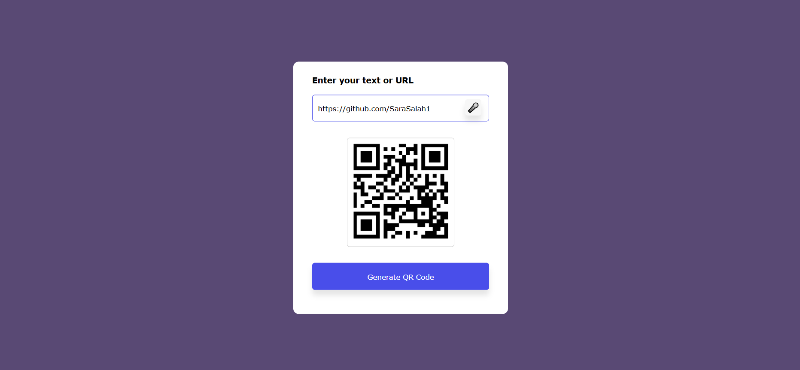

<div align="center">

# 🎯 QR Code Generator

### **Day 01 - JavaScript Mini Projects Series**

[](https://choosealicense.com/licenses/mit/)
[](https://www.ecma-international.org/)
[](https://html.spec.whatwg.org/)
[](https://www.w3.org/Style/CSS/)
[](http://makeapullrequest.com)

[Live Demo](https://sarasalah1.github.io/js-mini-projects/Day01-QR-Code-Generator/) • [Features](#-features) • [Installation](#-installation) • [Usage](#-usage) • [Customization](#-customization)



</div>

---

## 📖 About This Project

Part of the **JavaScript Mini Projects** series, this QR Code Generator combines modern web technologies with voice recognition capabilities. Create QR codes instantly for URLs, text, contact information, and more - all with zero dependencies!

### **✨ Key Highlights**

<table>
<tr>
<td width="50%">

#### 🎤 Voice Recognition
- Hands-free input using Web Speech API
- Real-time speech-to-text conversion
- Multi-language support (English default)

</td>
<td width="50%">

#### ⚡ Instant Generation
- Real-time QR code creation
- Smooth reveal animations
- Visual error feedback

</td>
</tr>
<tr>
<td>

#### 🎨 Modern Design
- Clean, professional interface
- Responsive layout for all devices
- Elegant animations and transitions

</td>
<td>

#### 🔒 Privacy-First
- Client-side processing only
- No data collection
- Zero external dependencies

</td>
</tr>
</table>

---

## 🚀 Features

- ✅ **Text & URL Input** - Type or paste any content
- ✅ **Voice Recognition** - Speak your input hands-free
- ✅ **Instant Generation** - Real-time QR code creation
- ✅ **Smart Validation** - Input error detection with shake animation
- ✅ **Responsive Design** - Works on desktop, tablet, and mobile
- ✅ **Smooth Animations** - Professional transitions and effects
- ✅ **Zero Dependencies** - Pure vanilla JavaScript
- ✅ **Browser Compatible** - Works across all modern browsers

---

## 🎬 Live Demo

### **Try it now:** [Click here for live demo](https://sarasalah1.github.io/js-mini-projects/Day01-QR-Code-Generator/)

### **How to Use:**

```
1️⃣ Enter text or URL (or click 🎤 to speak)
2️⃣ Click "Generate QR Code"
3️⃣ Scan your QR code instantly!
```

---

## 📥 Installation

### **Quick Start**

```bash
# Clone the repository
git clone https://github.com/SaraSalah1/js-mini-projects.git

# Navigate to the project
cd js-mini-projects/Day01-QR-Code-Generator

# Open in browser
open index.html
```

### **Or Download Directly**

1. Visit the [project folder](https://github.com/SaraSalah1/js-mini-projects/tree/main/Day01-QR-Code-Generator)
2. Download the files
3. Open `index.html` in your browser

### **For Development (Optional)**

```bash
# Using Python
python -m http.server 8000

# Using Node.js
npx serve

# Then visit http://localhost:8000
```

---

## 📁 Project Structure

```
Day01-QR-Code-Generator/
│
├── 📄 index.html          # Main HTML structure
├── 🎨 style.css           # Styling and animations
├── ⚙️  main.js            # Core functionality & voice recognition
└── 📝 README.md           # This file
```

---

## 💻 Usage

### **Method 1: Text Input**

1. Type or paste your text/URL into the input field
2. Click the **"Generate QR Code"** button
3. Your QR code appears instantly!

### **Method 2: Voice Input** 🎤

1. Click the **microphone icon** (🎤)
2. Allow microphone access if prompted
3. Speak your text clearly
4. Text auto-fills in the input field
5. Click **"Generate QR Code"**

### **Supported Content Types**

| Type | Example | Use Case |
|------|---------|----------|
| 🌐 **URLs** | `https://github.com` | Website links |
| 📧 **Email** | `mailto:sara@example.com` | Contact email |
| 📞 **Phone** | `tel:+1234567890` | Phone numbers |
| 💬 **SMS** | `sms:+1234567890` | Text messages |
| 📝 **Text** | `Any plain text` | General content |
| 📇 **vCard** | `BEGIN:VCARD...` | Contact cards |
| 📶 **WiFi** | `WIFI:T:WPA;S:network;P:pass;;` | WiFi credentials |

---

## 🎨 Customization

### **Change Color Scheme**

Edit `style.css`:

```css
body {
    background-color: #594974;  /* Purple background */
}

.container button {
    background-color: #494eea;  /* Blue accent */
}

.container input {
    border: 1px solid #494eea;  /* Input border */
}
```

### **Adjust QR Code Size**

Edit `main.js`:

```javascript
// Change from 150x150 to your preferred size
qrImg.src = 'https://api.qrserver.com/v1/create-qr-code/?size=300x300&data=' + qrText.value;

// Available sizes: 50x50 to 1000x1000
```

### **Modify Animation Speed**

Edit `style.css`:

```css
#imgBox {
    transition: max-height 1s;  /* Change to 0.5s for faster reveal */
}

.error {
    animation: shake 0.1s linear 10;  /* Adjust shake intensity */
}
```

---

## 🔧 Technical Details

### **Technologies Used**

- **HTML5** - Semantic markup
- **CSS3** - Modern styling with animations
- **JavaScript (ES6+)** - Core functionality
- **Web Speech API** - Voice recognition
- **QR Server API** - QR code generation

### **Browser Compatibility**

<div align="center">

| Browser | QR Generation | Voice Input | Min. Version |
|:-------:|:-------------:|:-----------:|:------------:|
| Chrome | ✅ | ✅ | 25+ |
| Edge | ✅ | ✅ | 79+ |
| Safari | ✅ | ✅ | 14.1+ |
| Firefox | ✅ | ❌ | 60+ |
| Opera | ✅ | ✅ | 27+ |

</div>

**Note:** Voice recognition requires HTTPS in production environments.

---

## 🌟 Features Breakdown

### **Voice Recognition Implementation**

```javascript
const recognition = new (window.SpeechRecognition || window.webkitSpeechRecognition)();
recognition.continuous = false;
recognition.interimResults = true;
recognition.lang = "en-US";
```

### **Error Handling**

- Visual shake animation for empty inputs
- Automatic error clearing after 1 second
- Browser compatibility checks

### **QR Code API**

```javascript
qrImg.src = 'https://api.qrserver.com/v1/create-qr-code/?size=150x150&data=' + qrText.value;
```

---

## 🐛 Known Issues & Solutions

| Issue | Status | Workaround |
|-------|--------|------------|
| Firefox voice input | ❌ Browser Limitation | Use Chrome/Safari/Edge |
| HTTPS for microphone | ⚠️ Security Requirement | Deploy with SSL or use localhost |
| Long text truncation | ℹ️ API Limitation | Keep inputs under 500 characters |

---

## 🤝 Contributing

Contributions are welcome! Here's how you can help:

1. **Fork** the repository
2. **Create** a feature branch: `git checkout -b feature/AmazingFeature`
3. **Commit** your changes: `git commit -m 'Add AmazingFeature'`
4. **Push** to the branch: `git push origin feature/AmazingFeature`
5. **Open** a Pull Request

### **Ideas for Contribution**

- [ ] Add download QR code functionality (PNG/SVG)
- [ ] Implement custom QR code colors
- [ ] Add QR code scanner feature
- [ ] Create dark mode toggle
- [ ] Add batch generation support
- [ ] Implement error correction levels

---

## 📚 Learn More

This project is part of the **JavaScript Mini Projects** series. Check out other projects:

- 🔗 [View All Projects](https://github.com/SaraSalah1/js-mini-projects)
- 📖 [Project Documentation](https://github.com/SaraSalah1/js-mini-projects#readme)

---

## 📜 License

This project is licensed under the **MIT License** - feel free to use it for learning and personal projects!

```
MIT License - Copyright (c) 2024 Sara Salah
```

---

## 🙏 Acknowledgments

- **QR Server API** - [goqr.me/api](https://goqr.me/api/) for free QR generation
- **Web Speech API** - [MDN Docs](https://developer.mozilla.org/en-US/docs/Web/API/Web_Speech_API)
- **Inspiration** - Modern web design principles

---

## 📧 Connect With Me

<div align="center">

[](https://github.com/SaraSalah1)
[](https://www.linkedin.com/in/sara-salah1/)
[](https://sarasalah1.github.io)

**Repository:** [js-mini-projects](https://github.com/SaraSalah1/js-mini-projects)

</div>

---

## 💖 Support This Project

If you found this helpful:

- ⭐ **Star** this repository
- 🐛 **Report** bugs via [Issues](https://github.com/SaraSalah1/js-mini-projects/issues)
- 💡 **Suggest** features
- 🔀 **Contribute** improvements
- 📢 **Share** with others learning JavaScript

---

<div align="center">

### **Made with ❤️ by [Sara Salah](https://github.com/SaraSalah1)**


**⭐ Star this repo if it helped you learn something new!**

</div>
